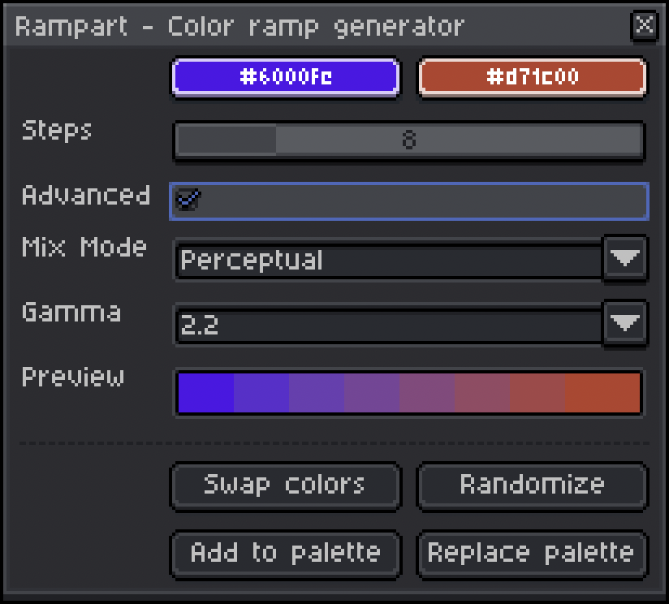

# Rampart 🏰
### An Aseprite extension by [sudo_whoami](https://sudo-whoami.itch.io)

This [Aseprite](https://aseprite.org) extension allows you to build color palettes quickly and easily by generating a gradual ramp between two colors of your chosing.

*current release: [v1.1.0](https://sudo-whoami.itch.io/rampart)*

## Latest Changes

Version 1.1.0 introduces an improved "Perceptual" mixing algorithm based on the [Oklab color space](https://en.wikipedia.org/wiki/Oklab_color_space), which looks a lot better than the naïve linear mixing algorithm most of the time. That said, because different people want different things, you can now select the mixing algorithm you prefer!

(the default is "Perceptual")

## Requirements

This extension has been tested on both Windows and Mac OS (specifically, Windows 11 and Mac OS Sonoma 14.3.1)

It is intended to run on Aseprite version 1.3 or later and requires API version 1.3-rc5 (as long as you have the latest version of Aseprite, you should be fine!)

## Features & Usage
To use this plugin, just open the **"Options"** (≡) menu above the color palette and then select **"Generate Color Ramp"**

</img>

Choose any two colors and Rampart will automatically generate a preview of the color ramp with the chosen number of steps - *anywhere between 2 and 32; the default is 8*

</img>

To reverse the ramp, click **"Swap Colors"**

If you're not sure where to start, click **"Randomize"** for some inspiration!

Once you're happy with your color ramp, you can click either **"Add to palette"** to append its colors to your current palette or click **"Replace palette"** to start a fresh palette with your ramp

## Advanced Mode
To enable more advanced functionality, check the **Advanced** box

</img>

In this mode you'll be able to select between two color mixing modes:
- "Perceptual", which handles color mixing in the [Oklab color space](https://en.wikipedia.org/wiki/Oklab_color_space) (this is the default mixing algorithm)
- "Linear", which applies basic linear color mixing

If "Perceptual" mixing mode is selected, you can also adjust the [gamma](https://en.wikipedia.org/wiki/Gamma_correction) correction level between 1.2 and 3.0 to fine-tune the mix

Gamma can be adjusted in increments of 0.2; the default is 2.2

This image shows the same color ramp in "Linear" mixing mode (first row) and then in "Perceptual" mixing mode with the gamma correction level increasing from 1.2 to 3.0 in each row:

***NOTE**: You may notice some very slight deviation in the endpoint colors at high or low gamma levels due to how Lua handles rounding; I'll try to fix this if I can!*

## Installation
You can download this extension from [itch.io](https://sudo-whoami.itch.io/rampart) as a "pay what you want" tool

If you find this extension useful, please consider donating via itch.io to support further development! &hearts;
