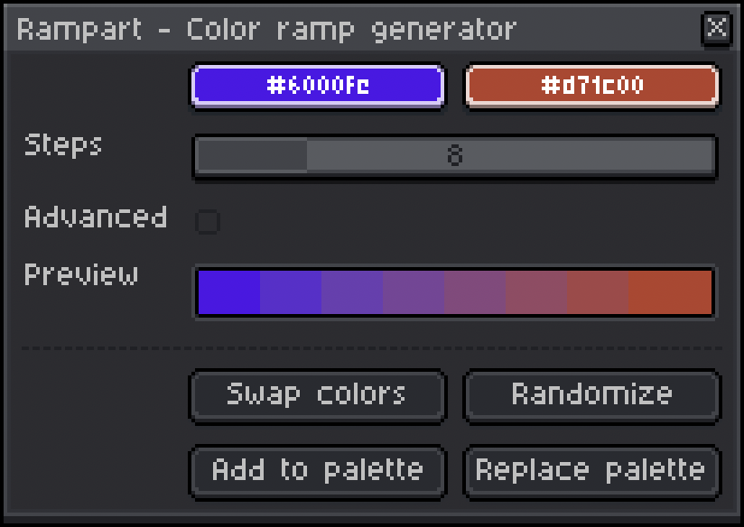

# Rampart 🏰
### An Aseprite extension by [sudo_whoami](https://sudo-whoami.itch.io)

This [Aseprite](https://aseprite.org) extension allows you to build color palettes quickly and easily by generating a gradual ramp between two colors of your chosing.

*current release: [v1.0.0](https://sudo-whoami.itch.io/rampart)*

## Latest Changes
- Initial release!

## Requirements

This extension has been tested on both Windows and Mac OS (specifically, Windows 11 and Mac OS Sonoma 14.3.1)

It is intended to run on Aseprite version 1.3 or later and requires API version 1.3-rc5 (as long as you have the latest version of Aseprite, you should be fine!)

## Features & Usage
To use this plugin, just open the **"Options"** (≡) menu above the color palette and then select **"Generate Color Ramp"**

</img>

Choose any two colors and Rampart will automatically generate a preview of the color ramp with the chosen number of steps - *anywhere between 2 and 32; the default is 8*

</img>

To reverse the ramp, click **"Swap Colors"**

If you're not sure where to start, click **"Randomize"** for some inspiration!

Once you're happy with your color ramp, you can click either **"Add to palette"** to append its colors to your current palette or click **"Replace palette"** to start a fresh palette with your ramp

## Installation
You can download this extension from [itch.io](https://sudo-whoami.itch.io/rampart) as a "pay what you want" tool

If you find this extension useful, please consider donating via itch.io to support further development! &hearts;
